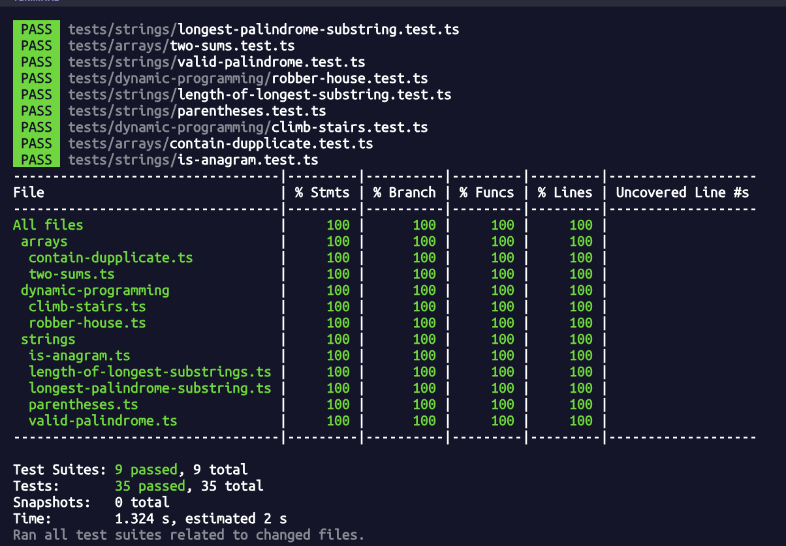

## Leetcode Easy - Medium
- https://leetcode.com/problems/climbing-stairs/description/
- https://leetcode.com/problems/longest-substring-without-repeating-characters/description/
- https://leetcode.com/problems/valid-anagram/description/
- https://leetcode.com/problems/valid-palindrome/description/
- https://leetcode.com/problems/valid-parentheses/
- https://leetcode.com/problems/longest-palindromic-substring/description/
- https://leetcode.com/problems/house-robber/description/
- https://leetcode.com/problems/contains-duplicate/description/
- https://leetcode.com/problems/two-sum/description/

## Test Coverage

## Road map
- leet code with Golang version (WIP)